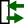

### Description

A petri net interface component of Q-type

### Theory
This is a placeholder component for a petri net interface. It contains no equations and should normally only be used when exporting or connecting the model to external tools.
