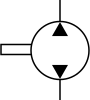

### Description

Contains a hydraulic pump with fixed displacement component

#### Input Variables
* **n_p** - Angular Velocity [rad/s]
* **D_p** - Displacement [m^3/rev]
* **C_lp** - Leakage coefficient [(m^3/s)/Pa]

#### Output Variables
* **a** - Angle [rad]

### Theory
Ideal flow is computed from the displacement, the angular velocity and the leakage flow:
<!---EQUATION LABEL=eq:flow q_2 = \dfrac{D_p}{2\pi} n_p - q_{leak}--->
<!---EQUATION q_{leak} = C_{lp}(p_2-p_1) --->
<!---EQUATION q_1 = -q_2 --->

#### Hopsan TLM adaption
The pressures are obtained using the TLM boundary equations:
<!---EQUATION p_1 = c_1 + Z_{c1}q_1--->
<!---EQUATION p_2 = c_2 + Z_{c2}q_2--->

The leakage flow then becomes:
<!---EQUATION LABEL=eq:leak q_{leak} = C_{lp}(c_2 + Z_{c2}q_2 - c_1 - Z_{c1}q_1) --->

Inserting equation EQREF{eq:leak} into equation EQREF{eq:flow} then yields the implemented equation:
<!---EQUATION q_2 = \dfrac{ \dfrac{D_p}{2\pi}n_p + C_{lp}(c_1-c_2) }{ (Z_{c1}+Z_{c2})C_{lp}+1 }--->

