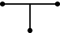

### Description

A hydraulic lossless T-connector model.

#### Port Initial Conditions
No initial conditions can be set for Q-type blocks.

<!--- ### Tips--->

### Theory
This component is implemented as a a T-connection of laminar orifices with unrestricted flow. Using this between three volumes will cause the volumes behave as one large volume. A time delay will however be introduced, possibly reducing the numerical stability. Note that this component will not define the flow in the system. A system with only volumes and lossless connectors will result in undefined flows.

The pressure in both ports will always be the same. The flow will be computed as a consequence of this relationship.
<!---EQUATION LABEL=eq:pressures p_1 = p_2 = p_3 --->
Cavitation is handled by forcing pressures to be greater than or equal to zero.
#### Hopsan TLM adaption
In Q components the positive flow direction is outwards from each port, in this case the TLM equations are
<!---EQUATION p_{1} = c_{1} + q_{1} Z_{c1} --->
<!---EQUATION p_{2} = c_{2} + q_{2} Z_{c2} --->
<!---EQUATION p_{3} = c_{3} + q_{3} Z_{c3} --->
<!---EQUATION q_{1} + q_{2} + q_{3} = 0 --->
The flow equation can now be derived in the following steps:
<!---EQUATION p_1 = p_2 = p_3 = p --->
<!---EQUATION p = c_{1} + q_{1} Z_{c1} --->
<!---EQUATION p = c_{2} + q_{2} Z_{c2} --->
<!---EQUATION p = c_{3} + q_{3} Z_{c3} --->
<!---EQUATION q_1 = \dfrac{p-c_1}{Z_{c1}} --->
<!---EQUATION q_2 = \dfrac{p-c_2}{Z_{c2}} --->
<!---EQUATION q_3 = \dfrac{p-c_3}{Z_{c3}} --->
<!---EQUATION \dfrac{p-c_1}{Z_{c1}} + \dfrac{p-c_2}{Z_{c2}} + \dfrac{p-c_3}{Z_{c3}} = 0 --->
Which finally becomes the implemented equation EQREF{eq:final}

<!---EQUATION LABEL=eq:final p = \dfrac{\dfrac{c_1}{Z_{c1}} + \dfrac{c_2}{Z_{c2}} + \dfrac{c_3}{Z_{c3}}}{\dfrac{1}{Z_{c1}} + \dfrac{1}{Z_{c2}} + \dfrac{1}{Z_{c3}}} --->

