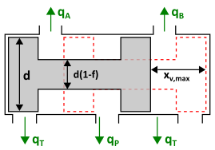

### Description

Contains a hydraulic 4/2-valve of Q-type

#### Input Variables
* **omega_h** - Resonance Frequency [Hz]
* **delta_h** - Damping Factor [-]
* **in** - Desired spool position [m]
* **C_q** - Flow Coefficient [-]
* **rho** - Oil density [kg/m^3]
* **d** - Spool Diameter [m]
* **f_pa** - Fraction of spool circumference that is opening P-A [-]
* **f_bt** - Fraction of spool circumference that is opening B-T [-]
* **f_pb** - Fraction of spool circumference that is opening P-B [-]
* **f_at** - Fraction of spool circumference that is opening A-T [-]
* **x_vmax** - Maximum Spool Displacement [m]

#### Output Variables
* **xv** - Spool position [m]

### Theory
Hydraulic directional valve with second order dynamics. Spool moves to position 1 if input signal is false (&lt; 0.5) or to position 2 if input signal is true (> 0.5). Dynamics is modelled as a low-pass filter with bandwidth and damping.

<!---EQUATION q_{i\rightarrow j} = C_q A_{i\rightarrow j}\sqrt{\dfrac{2}{\rho}\left(p_i-p_j\right)} --->
<!---EQUATION A_{p\rightarrow a}=f_{p\rightarrow a}d\pi x_v ---> 
<!---EQUATION A_{p\rightarrow b}=f_{p\rightarrow b}d\pi (x_{v,max}-x_v) ---> 
<!---EQUATION A_{a\rightarrow t}=f_{a\rightarrow t}d\pi (x_{v,max}-x_v) ---> 
<!---EQUATION A_{b\rightarrow t}=f_{b\rightarrow t}d\pi x_v ---> 
<!---EQUATION x_v = \dfrac{x_{ref}}{\dfrac{s^2}{\omega_h^2}+\dfrac{2\delta_h}{\omega_h}s+1} --->
<!---EQUATION x_{ref} = \begin{cases}0, & in \le 0.5\\1, & in > 0.5\end{cases} --->
Cavitation is handled by forcing pressures to be greater than or equal to zero.
#### Hopsan TLM adaption
In Q components the positive flow direction is outwards from each port, in this case the TLM equations are
<!---EQUATION p_{i} = c_{i} + q_{i} Z_{c,i} --->
<!---EQUATION q_{j} = -q_{i} = q_{i\rightarrow j} --->
Inserting this into equation EQREF{eq:flow} and taking negative pressure drops into account gives the implemented equation EQREF{eq:final}:

<!---EQUATION LABEL=eq:final q_{i \rightarrow j} = \begin{cases} K_s \left(\sqrt{c_i-c_j+\dfrac{(Z_{c,i}+Z_{c,j})^2K_s^2}{4}} - K_s\dfrac{Z_{c,i}+Z_{c,j}}{2}\right), c_i > c_j\\ K_s\left(K_s\dfrac{(Z_{c,i}+Z_{c,j})}{2} - \sqrt{c_j-c_i+\dfrac{(Z_{c,i}+Z_{c,j})^2 K_s^2}{4}}\right), c_i \le c_j \end{cases} --->

where

<!---EQUATION LABEL=eq:Ks K_s = C_q A_{i\rightarrow j} \sqrt{\dfrac{2}{\rho}} --->
