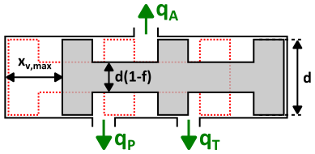

### Description

Hydraulic 3/3-valve (closed centre) of Q-type.

#### Input Variables
* **omega_h** - Resonance Frequency [Hz]
* **delta_h** - Damping Factor [-]
* **in** - Desired spool position [m]
* **C_q** - Flow Coefficient [-]
* **rho** - Oil density [kg/m^3]
* **d** - Spool Diameter [m]
* **f_pa** - Fraction of spool circumference that is opening P-A [-]
* **f_at** - Fraction of spool circumference that is opening A-T [-]
* **x_vmax** - Maximum Spool Displacement [m]
* **x_pa** - Spool Overlap From Port P To A [m]
* **x_at** - Spool Overlap From Port A To T [m]

#### Port Initial Conditions
No initial conditions can be set for Q-type blocks.

<!--- ### Tips--->

### Theory
Dynamics is modelled as a low-pass filter with bandwidth and damping. A turbulent flow model is used. The opening area in each direction depends on the spool position, which is computed from the input signal using second order dynamics. Overlap (or underlap) can be specified individually for each flow direction.
<!---EQUATION q_{i\rightarrow j} = C_q A\sqrt{\dfrac{2}{\rho}\left(p_i-p_j\right)} --->
<!---EQUATION A=f\dfrac{d^2\pi}{4}x_{i\rightarrow j} ---> 
<!---EQUATION x_{p\rightarrow a} = \dfrac{x_{in}}{\dfrac{s^2}{\omega_h^2}+\dfrac{2\delta_h}{\omega_h}s+1} - x_{pa} --->
<!---EQUATION x_{a\rightarrow t} = -\dfrac{x_{in}}{\dfrac{s^2}{\omega_h^2}+\dfrac{2\delta_h}{\omega_h}s+1} - x_{at} --->

#### Hopsan TLM adaption
In Q components the positive flow direction is outwards from each port, in this case the TLM equations are
<!---EQUATION p_{i} = c_{i} + q_{i} Z_{c,i} --->
<!---EQUATION q_{j} = -q_{i} = q_{i\rightarrow j} --->
Inserting this into equation EQREF{eq:flow} and taking negative pressure drops into account gives the implemented equation EQREF{eq:final}:

<!---EQUATION LABEL=eq:final q_{i \rightarrow j} = \begin{cases} K_s \left(\sqrt{c_i-c_j+\dfrac{(Z_{c,i}+Z_{c,j})^2K_s^2}{4}} - K_s\dfrac{Z_{c,i}+Z_{c,j}}{2}\right), c_i > c_j\\ K_s\left(K_s\dfrac{(Z_{c,i}+Z_{c,j})}{2} - \sqrt{c_j-c_i+\dfrac{(Z_{c,i}+Z_{c,j})^2 K_s^2}{4}}\right), c_i \le c_j \end{cases} --->

where

<!---EQUATION LABEL=eq:Ks K_s = C_q A_{i\rightarrow j} \sqrt{\dfrac{2}{\rho}} --->
