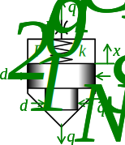

### Description

A hydraulic 2/2 poppet valve of Q-type

#### Input Variables
* **x_vmax** - Maximum Spool Displacement [m]
* **d_d** - Damp orifice diam. [m]
* **C_q** - Flow Coefficient [-]
* **rho** - Oil density [kg/m^3]
* **d_1** - Small diameter [m]
* **d_2** - Big diameter [m]
* **k** - Spring constant [N/m]
* **F_0** - Spring pre-load [N]
* **f** - Fraction of poppet diameter that is opening [-]

#### Output Variables
* **xv_out** - Spool position [-]

### Theory
The poppet has three areas:
<!---EQUATION A_N = \pi\dfrac{d_1^2}{4} --->
<!---EQUATION A_C = \pi\dfrac{d_2^2}{4} --->
<!---EQUATION A_S = A_C-A_N --->

Main flow:
<!---EQUATION q_N = C_q d_d f x_v \sqrt{\dfrac{2}{rho}(p_1 - p_2)} --->
<!---EQUATION q_S = -q_N --->

Poppet position is integrated from spool velocity:
<!---EQUATION v_v = \dfrac{dx_v}{dt}--->

Spool velocity is computed from the flow through the damping orifice: 
<!---EQUATION v_v = \dfrac{q_C}{A_C} --->

Flow through the damping orifice is modelled as a turbulent flow through a fixed area orifice:
<!---EQUATION q_C = C_q\pi \dfrac{D_d^2}{4}\sqrt{\dfrac{2}{\rho}(p_c)} --->

Finally, pressure in the damping chamber is computed using force equilibrium on the poppet:
<!---EQUATION p_c = \dfrac{A_N p_N + A_S p_S -(F_0+k x_v)}{A_C} --->

### Hopsan TLM Adaption
Pressures are computed from wave variables and characteristic impedances using the TLM boundary equations:
<!---EQUATION p_N = c_N + Z_{cN}q_N --->
<!---EQUATION p_S = c_S + Z_{cS}q_S --->
<!---EQUATION p_C = c_C + Z_{cC}q_C --->

Inserting this into equation EQREF{eq:flow} and taking negative pressure drops into account gives the implemented equation EQREF{eq:final}:

<!---EQUATION LABEL=eq:final q_{i \rightarrow j} = \begin{cases} K_s \left(\sqrt{c_i-c_j+\dfrac{(Z_{c,i}+Z_{c,j})^2K_s^2}{4}} - K_s\dfrac{Z_{c,i}+Z_{c,j}}{2}\right), c_i > c_j\\ K_s\left(K_s\dfrac{(Z_{c,i}+Z_{c,j})}{2} - \sqrt{c_j-c_i+\dfrac{(Z_{c,i}+Z_{c,j})^2 K_s^2}{4}}\right), c_i \le c_j \end{cases} --->

where

<!---EQUATION LABEL=eq:Ks K_s = C_q A_{i\rightarrow j} \sqrt{\dfrac{2}{\rho}} --->
