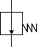

### Description

A hydraulic pressure controlled valve with first order dynamics, flow forces and hysteresis

#### Input Variables
* **tao** - Time Constant of Spool [s]
* **k_cs** - Steady State Characteristic due to Spring [LeakageCoefficient]
* **k_cf** - Steady State Characteristic due to Flow Forces [LeakageCoefficient]
* **q_nom** - Flow with Fully Open Valve and pressure drop Pnom [m^3/s]
* **p_ref** - Reference Opening Pressure [Pa]
* **p_h** - Hysteresis Width [Pa]

#### Output Variables
* **xv** - Spool position [m]

### Theory
The valve can be opened or closed using the external control ports. The valve is fully opened at the neutral position. A turbulent flow model is used. The flow coefficient is computed from steady-state characteristics.

Differentiating the flow with respect to the control pressure (<i>p1</i> - <i>pref</i> yields:
<!---EQUATION \dfrac{q}{k_{cs}} + \dfrac{q}{k_{cf}}\dfrac{\Delta p}{p_1-p_2} = p_{open} - p_{ref} - p_{close}--->

The relationship between nominal pressure (<i>pnom</i> = 70 bar) and nominal flow is known:
<!---EQUATION q_{nom} = q_{nom} - K_e\sqrt{p_{nom}} = \dfrac{p_{open} - p_{ref} - p_{close}}{\dfrac{1}{k_{cs}} + \dfrac{1}{k_{cf}}\dfrac{p_1-p_2}{p_{nom}}} --->

This can be used to compute the turbulent flow coefficient:
<!---EQUATION K_e = \dfrac{q_{nom}}{\sqrt{p_{nom}}} - \dfrac{p_{open} - p_{ref} - p_{close}}{\dfrac{1}{k_{cs}} + \dfrac{1}{k_{cf}}\dfrac{p_1-p_2}{p_{nom}}}\dfrac{1}{\sqrt{p_{nom}}} --->

This gives the final expression for the turbulent flow:
<!---EQUATION q_2 = \dfrac{q_{nom}}{\sqrt{p_{nom}}} - K_e \sqrt{p_1-p_2} = \dfrac{q_{nom}}{\sqrt{p_{nom}}} - \dfrac{p_{open} - p_{ref} - p_{close}}{\dfrac{1}{k_{cs}} + \dfrac{1}{k_{cf}}\dfrac{p_1-p_2}{p_{nom}}}\dfrac{\sqrt{p_1-p_2}}{\sqrt{p_{nom}}} --->

Finally, hysteresis and dynamics are applied using specified hysteresis width and time constant.

