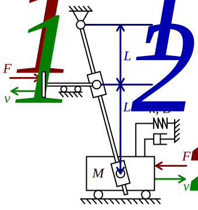

### Description

Contains a Lever with a Mass

#### Input Variables
* **L_1** - Length [m]
* **L_2** - Length [m]
* **m** - Mass [kg]
* **B** - Viscous Friction [Ns/m]

#### Output Variables

#### Port Initial Conditions
No initial conditions can be set for Q-type blocks.

<!--- ### Tips--->

### Theory
The lever arm provides a gear ratio between left and right side:
<!---EQUATION w = \dfrac{L_1-L_2}{L_1} --->

The motion of the mass is modelled using Newton's second law of motion as a second order transfer function:
<!---EQUATION v_2 = \dfrac{F_1/w - F_2}{m s + B}--->
<!---EQUATION x_2 = \dfrac{F_1/w - F_2}{m s^2 + B s}--->
<!---EQUATION v_2 = -w v_1  --->
<!---EQUATION x_2 = -w x_1 --->

#### Hopsan TLM adaption
TLM boundary equation gives:
<!---EQUATION F_1 = c_1 + Z_{c1}v_1 --->
<!---EQUATION F_2 = c_2 + Z_{c2}v_2 --->

Inserting this into the equations of motion yields:
<!---EQUATION v_2 = \dfrac{c_1/w - c_2}{m s + B + Z_{c1}/w^2 + Z_{c2}}--->
<!---EQUATION x_2 = \dfrac{c_1/w - c_2}{m s^2 + (B + Z_{c1}/w^2 + Z_{c2}) s}--->

