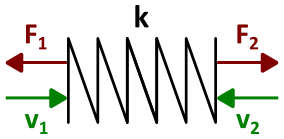

### Description

Contains a mechanical translational spring component with slack

#### Input Variables
* **k** - Spring constant [N/m]

### Theory
The spring force is modelled using Hooke's law:
<!---EQUATION F_2 = k(x_1 - x_2) --->

#### Hopsan TLM adaption
Delayed information is propagated from left to right side using wave variables:
<!---EQUATION \begin{cases}c_1(t) = F_2(t-\Delta t) + Z_c v_2(t-\Delta t), & x_1+x_2 > 0\\0, & x_1+x_2 \le 0\end{cases} --->
<!---EQUATION \begin{cases}c_2(t) = F_1(t-\Delta t) + Z_c v_1(t-\Delta t), & x_1+x_2 > 0\\0, & x_1+x_2 \le 0\end{cases} --->
The characteristic impedance of the volume is calculated using the spring constant, the time step and the low pass filter coefficient:
<!---EQUATION Z_c = \begin{cases}\dfrac{k \Delta_t}{1-\alpha}, & x_1+x_2 > 0\\0, & x_1+x_2 \le 0\end{cases} --->
The pressure is then integrated using the TLM boundary equations:
<!---EQUATION \begin{cases}F_1(t) = c_1(t) + Z_c v_1(t)\\F_2(t) = c_2(t) + Z_c v_2(t)\end{cases} --->

