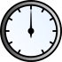

### Description

Signal Animated Gauge. Does nothing in the simulation. Used to display variables in an analog fashion during animation.

#### Input Variables
* **max** - Upper limit [-]
* **in** -  [-]

