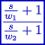

### Description

A first order filter component using bilinear transform

#### Input Variables
* **k** - Gain [-]
* **omega_num** - Numerator break frequency [Frequency]
* **omega_den** - Denominator break frequency [Frequency]
* **y_min** - Lower output limit [-]
* **y_max** - Upper output limit [-]
* **in** -  [-]

#### Output Variables
* **out** - Filtered value [-]

### Theory
A general first order filter with a gain and break frequencies for numerator and denominator:
<!---EQUATION out = k\dfrac{\dfrac{s}{\omega_{num}}+1}{\dfrac{s}{\omega_{den}}+1} in--->

The filter is discretized using bilinear transform:
<!---EQUATION s\leftarrow {\dfrac {2}{T}}{\dfrac {1-z^{-1}}{1+z^{-1}}} --->

Where <i>z-1</i> represents a unit delay:

<!---EQUATION z^{-1}x(t) = x(t-\Delta t) --->

