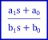

### Description

A general first order transfer function using bilinear transform

#### Input Variables
* **a_1** - S^1 numerator coefficient [-]
* **a_0** - S^0 numerator coefficient [-]
* **b_1** - S^1 denominator coefficient [-]
* **b_0** - S^0 denominator coefficient [-]
* **in** -  [-]

#### Output Variables
* **out** - Filtered value [-]

### Theory
A general first order transfer fucntion with four coefficients:
<!---EQUATION out = \dfrac{a_1 s + a_0}{b_1 s + b_0} in--->

The filter is discretized using bilinear transform:
<!---EQUATION s\leftarrow {\dfrac {2}{T}}{\dfrac {1-z^{-1}}{1+z^{-1}}} --->

Where <i>z-1</i> represents a unit delay:

<!---EQUATION z^{-1}x(t) = x(t-\Delta t) --->

