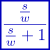

### Description

A first order high pass filter using bilinear transform

#### Input Variables
* **omega** - Break frequency [Frequency]
* **y_min** - Lower output limit [-]
* **y_max** - Upper output limit [-]
* **in** -  [-]

#### Output Variables
* **out** -  [-]

### Theory
A general first order high pass filter with a break frequency:
<!---EQUATION out = \dfrac{\dfrac{s}{\omega}}{\dfrac{s}{\omega}+1} in--->

The filter is discretized using bilinear transform:
<!---EQUATION s\leftarrow {\dfrac {2}{T}}{\dfrac {1-z^{-1}}{1+z^{-1}}} --->

Where <i>z-1</i> represents a unit delay:

<!---EQUATION z^{-1}x(t) = x(t-\Delta t) --->
