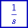

### Description

An integrator component using bilinaer transform

#### Input Variables
* **in** -  [-]

#### Output Variables
* **out** -  [-]

### Theory
Output is integrated from the input signal:
<!---EQUATION out =\dfrac{1}{s} in--->

The filter is discretized using bilinear transform:
<!---EQUATION s\leftarrow {\dfrac {2}{T}}{\dfrac {1-z^{-1}}{1+z^{-1}}} --->

Where <i>z-1</i> represents a unit delay:

<!---EQUATION z^{-1}x(t) = x(t-\Delta t) --->

