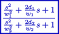

### Description

A second order filter component using bilinear transform

#### Input Variables
* **k** - Gain [-]
* **omega_1** - Numerator break frequency [Frequency]
* **delta_1** - Numerator damp coefficient [-]
* **omega_2** - Denominator break frequency [Frequency]
* **delta_2** - Denominator damp coefficient [-]
* **y_min** - Lower output limit [-]
* **y_max** - Upper output limit [-]
* **in** -  [-]

#### Output Variables
* **out** -  [-]

### Theory
A general second order filter with a gain and break frequencies and damping coefficients for numerator and denominator:
<!---EQUATION out = k\dfrac{\dfrac{s^2}{\omega_{num}^2} + \dfrac{2\delta_{num}}{\omega_{num}} + 1}{\dfrac{s^2}{\omega_{den}^2} + \dfrac{2\delta_{den}}{\omega_{den}} + 1} in--->

The filter is discretized using bilinear transform:
<!---EQUATION s\leftarrow {\dfrac {2}{T}}{\dfrac {1-z^{-1}}{1+z^{-1}}} --->

Where <i>z-1</i> represents a unit delay:

<!---EQUATION z^{-1}x(t) = x(t-\Delta t) --->

