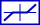

### Description

Adds a dead zone to the input signal.

#### Input Variables
* **in** - Input signal [-]
* **u_dstart** - Start of Dead Zone [-]
* **u_dend** - End of Dead Zone [-]

#### Output Variables
* **out** - Output signal [-]

### Theory
<!---EQUATION out = \begin{cases}in - u_{dstart}, & in < u_{dstart}\\0, & u_{dstart} \le in \le u_{dend}\\in - u_{dend}, & in > u_{dend}\end{cases} --->

