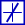

### Description

Contains a signal rate limiter component

#### Input Variables
* **c_up** - Maximum increase rate [unit/s]
* **c_down** - Maximum decrease rate [unit/s]
* **in** -  [-]

#### Output Variables
* **out** -  [-]

### Theory
Limits the rate of change (i.e. slope) of the output variable to be within specified limits.

<!---EQUATION out = \begin{cases}in, & out - c_{down}t_{step} \le in \le out + c_{up}t_{step}\\out + c_{up}t_{step}, & in > out + c_{up}t_{step}\\out - c_{down}t_{step}, & in < out + c_{down}t_{step}\end{cases}--->

