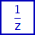

### Description

Algebraic loop delay hint component

#### Input Variables
* **in** - Input variable [-]

#### Output Variables
* **out** - Output variable [-]

### Theory
This component does not change any variables. It is only used to inform the simulation core where to break algebraic loops. If not connected in a loop, the component will have no effect on simulation results.

<!---EQUATION out = in --->

