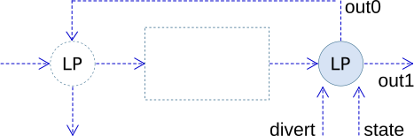

### Description

FFBD loop output component

#### Input Variables
* **in0** - Input 0 [-]
* **divert** - Input 0 [-]

#### Output Variables
* **state** - State activated [-]
* **out0** - exiting to alt 0 [-]
* **out1** - exiting to alt 0 [-]

### Theory
This component is intended for creating the exit point of a loop, where <i>out1</i> is connected to the input loop component.

* A rising flank on <i>in0</i> while <i>divert</i> is inactive will cause a single pulse on ports <i>out0</i> and <i>state</i>.
* A rising flank on <i>in0</i> while <i>divert</i> is active will cause a single pulse on ports <i>out1</i> and <i>state</i>.
