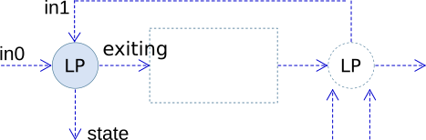

### Description

FFB loop input component

#### Input Variables
* **in0** - Input 0 [-]
* **in1** - Input 1 [-]

#### Output Variables
* **state** - State activated [-]
* **exiting** - exiting to alt 0 [-]

### Theory
This component is intended for creating a loop, where <i>in1</i> is connected to the feedback from a loop output component.

A rising flank on either <i>in0</i> or <i>in1</i> will cause a single pulse on ports <i>state</i> and <i>exiting</i>.
