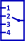

### Description

Signal routing component with four inputs

#### Input Variables
* **limit12** - Limit value between input 1 and 2 [-]
* **limit23** - Limit value between input 2 and 3 [-]
* **limit34** - Limit value between input 3 and 4 [-]
* **in1** -  [-]
* **in2** -  [-]
* **in3** -  [-]
* **in4** -  [-]
* **route** - Input selection [-]

#### Output Variables
* **out** - Selected input [-]

### Theory
Forwards input 1, 2, 3 or 4 to the output depending on the route signal and the limit parameters.
<!---EQUATION out = \begin{cases}in_1, & route < limit_{12}\\in_2, & limit_{12} \le route < limit_{23}\\in_3, & limit_{23} \le route < limit_{34}\\in_4, & route \ge limit_{34}\end{cases}--->
