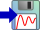

### Description

Contains a signal logger component

#### Input Variables
* **in** - Input variables (multiport) [-]
* **path** - Path to output log file [-]
* **names** - Variable names (comma separated) [-]
* **aliases** - Variable aliases (comma separated) [-]
* **units** - Variable units (comma separated) [-]
* **dt** - Logging Interval (0 = log every sample) [s]

### Theory
This component logs connected input variables to an external files. Lists with paths, names, aliases and units must have same size as number of connections to the input port. 
