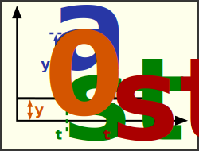

### Description

Contains a pulse signal generator

#### Input Variables
* **y_0** - Base Value [-]
* **y_A** - Amplitude [-]
* **t_start** - Start Time [Time]
* **t_end** - Stop Time [Time]

#### Output Variables
* **out** - Pulse [-]

### Theory
Generates a pulse with specified amplitude between start and stop time:
<!---EQUATION out = \begin{cases}y_0, & t < t_{start}\\y_0+y_A, & t_{start} \le t \le t_{end}\\y_0, &t>t_{end}\end{cases}--->

