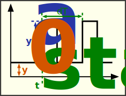

### Description

Contains a pulse wave (train) signal generator

#### Input Variables
* **y_0** - Base Value [-]
* **y_A** - Amplitude [-]
* **t_start** - Start Time [Time]
* **dT** - Time Period [Time]
* **D** - Duty Cycle, (ratio 0<=x<=1) [-]

#### Output Variables
* **out** - PulseWave [-]

### Theory
The dutycycle D, is the ratio of the PeroidTime dT when the signal is high
<!---EQUATION \begin{cases}y_0+y_A, & t-t_{start} - \lfloor t/dT \rfloor dT < D dT\\y_0  & t-t_{start} - \lfloor t/dT \rfloor dT \ge D dT\end{cases}--->

