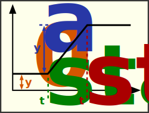

### Description

A ramp signal generator

#### Input Variables
* **y_0** - Base Value [-]
* **y_A** - Amplitude [-]
* **t_start** - Start Time [Time]
* **t_end** - Stop Time [Time]

#### Output Variables
* **out** - Ramp output [-]

### Theory
The ramp will start from base value at the start time, and increase lienarly with specified amplitude until stop time.
<!---EQUATION \begin{cases}y_0, & t < t_{start}\\ y_0 + \left(\dfrac{t - t_{start}}{t_{stop} - t_{start}}\right) y_A, & t_{start} \le t \le t_{end}\\y_0+y_A, & t > t_{end}\end{cases}--->

