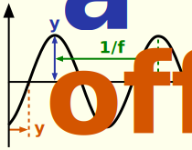

### Description

Sine wave signal generator component.

#### Input Variables
* **f** - Frequencty [Hz]
* **y_A** - Amplitude [-]
* **y_offset** - (Phase) Offset [Time]
* **t_start** - Start Time [Time]

#### Output Variables
* **out** - Sinus wave output [-]

### Theory
Generates a sine wave with specified start time, frequency, offset and amplitude.
<!---EQUATION out = y_A \sin(((t-t_{start})-y_{offset}) 2\pi f)--->

