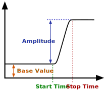

### Description

A soft step generator component.

#### Input Variables
* **t_start** - Start Time [Time]
* **t_end** - Stop Time [Time]
* **y_0** - Base Value [-]
* **y_A** - Amplitude [-]

#### Output Variables
* **out** -  [-]

### Theory
The step is modelled with a sinusoidal shape between start time and stop time.

<!---EQUATION out = \begin{cases}y_0, & t < t_{start}\\y_0 + 0.5 y_A \sin\left(\dfrac{t-t_{start}}{t_{stop}-t_{start}}\pi - 0.5\pi\right) + 0.5y_A, & t_{start} \le t \le t_{stop}\\y_0 + y_A, & t > t_{stop}\end{cases}--->

