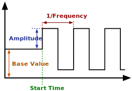

### Description

A square wave signal generator component

#### Input Variables
* **y_0** - Base Value [-]
* **y_A** - Amplitude [-]
* **f** - Frequencty [Hz]
* **t_start** - Start Time [Time]

#### Output Variables
* **out** - Square wave output [-]

### Theory
Generates a square wave, starting at specified start time.

<!---EQUATION out = \begin{cases}y_0, & t < t_{start}\\y_0 + y_A, & \sin( (t-t_{start})2\pi f ) \ge 0\\y_0 - y_A, & \sin( (t-t_{start})2\pi f ) < 0\end{cases}--->

