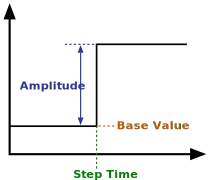

### Description

A step signal generator component.

#### Input Variables
* **y_0** - Base Value [-]
* **y_A** - Amplitude [-]
* **t_step** - Step Time [Time]

#### Output Variables
* **out** - Step output [-]

### Theory
Generates a step with specified amplitude at specified step time.
<!---EQUATION out = \begin{cases}y_0, & t < t_{step}\\y_0+y_A, t \ge t_{step}--->

