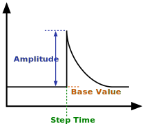

### Description

Contains a Step With Exponential Delay signal generator

#### Input Variables
* **y_0** - Base Value [-]
* **y_A** - Amplitude [-]
* **tao** - Time Constant of Delay [-]
* **t_step** - Step Time [Time]

#### Output Variables
* **out** -  [-]

#### Port Initial Conditions
No initial conditions can be set for Q-type blocks.

<!--- ### Tips--->

### Theory
Generates a step with specified amplitude at specified step time. After the step, the value will decay back towards the base value. This component is useful when performing discrete frequency analysis.

<!---EQUATION out = \begin{cases}y_0, & t<t_{step}\\y_0+y_A e^{-(t-t_{step})/\tau}, & t \ge t_{step}\end{cases}--->

