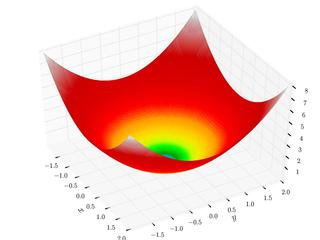

### Description

2-dimensional optimization test functions component

#### Input Variables
* **x** -  [-]
* **y** -  [-]

#### Output Variables
* **out** -  [-]

### Ackley's Function

<!---EQUATION out=-20\exp \left(-0.2{\sqrt {0.5\left(x^2+y^2\right)}}\right)− \exp\left( 0.5 ( \cos 2\pi x  + \cos 2\pi y  ) \right) + \exp(1) + 20  --->

### Beale's Function

<!---EQUATION out=\left(1.5-x+xy\right)^{2}+\left(2.25-x+xy^{2}\right)^{2} + ( 2.625 − x + x y 3 ) 2 {\displaystyle +\left(2.625-x+xy^{3}\right)^{2}} +\left(2.625-x+xy^{3}\right)^{2} --->

### Booth's Function

<!---EQUATION out=\left(x+2y-7\right)^{2}+\left(2x+y-5\right)^{2} --->

### Bukin Function N.6

<!---EQUATION out=100{\sqrt {\left|y-0.01x^{2}\right|}}+0.01\left|x+10\right| --->

### Cross-in-Tray Function

<!---EQUATION {\displaystyle out=-0.0001\left[\left|\sin x\sin y\exp \left(\left|100-{\frac {\sqrt {x^{2}+y^{2}}}{\pi }}\right|\right)\right|+1\right]^{0.1}} --->

### Easom Function

<!---EQUATION out=-\cos \left(x\right)\cos \left(y\right)\exp \left(-\left(\left(x-\pi \right)^{2}+\left(y-\pi \right)^{2}\right)\right) --->

### Eggholder Function

<!---EQUATION {\displaystyle out=-\left(y+47\right)\sin {\sqrt {\left|{\frac {x}{2}}+\left(y+47\right)\right|}}-x\sin {\sqrt {\left|x-\left(y+47\right)\right|}}} --->

### Goldstein-Price Function

<!---EQUATION {\displaystyle out=\left[1+\left(x+y+1\right)^{2}\left(19-14x+3x^{2}-14y+6xy+3y^{2}\right)\right]} [ 30 + ( 2 x − 3 y ) 2 ( 18 − 32 x + 12 x 2 + 48 y − 36 x y + 27 y 2 ) ] {\displaystyle \left[30+\left(2x-3y\right)^{2}\left(18-32x+12x^{2}+48y-36xy+27y^{2}\right)\right]} {\displaystyle \left[30+\left(2x-3y\right)^{2}\left(18-32x+12x^{2}+48y-36xy+27y^{2}\right)\right]} --->

### Holder Table Function

<!---EQUATION {\displaystyle out=-\left|\sin x\cos y\exp \left(\left|1-{\frac {\sqrt {x^{2}+y^{2}}}{\pi }}\right|\right)\right|} --->

### Lévi Function N.13

<!---EQUATION {\displaystyle out=\sin ^{2}3\pi x+\left(x-1\right)^{2}\left(1+\sin ^{2}3\pi y\right)} + ( y − 1 ) 2 ( 1 + sin 2 ⁡ 2 π y ) {\displaystyle +\left(y-1\right)^{2}\left(1+\sin ^{2}2\pi y\right)} {\displaystyle +\left(y-1\right)^{2}\left(1+\sin ^{2}2\pi y\right)} --->

### Matyas Function

<!---EQUATION out=0.26\left(x^{2}+y^{2}\right)-0.48xy --->

### McCormick Function

<!---EQUATION out=\sin \left(x+y\right)+\left(x-y\right)^{2}-1.5x+2.5y+1 --->

### Peaks Function

<!---EQUATION 3(1-x)^2\exp(-x^2 - (y+1)^2) - 10(\dfrac{x}{5} - x^3 - y^5)\exp(-x^2-y^2) - \dfrac{1}{3}\exp(-(x+1)^2 - y^2) --->

### Rosenbrock Function

<!---EQUATION {\displaystyle out=(1-x)^2+100(y-x^2)^2 } --->

### Schaffer Function N.2

<!---EQUATION {\displaystyle out=0.5+{\frac {\sin ^{2}\left(x^{2}-y^{2}\right)-0.5}{\left[1+0.001\left(x^{2}+y^{2}\right)\right]^{2}}}} --->

### Schaffer Function N.4

<!---EQUATION {\displaystyle out=0.5+{\frac {\cos ^{2}\left[\sin \left(\left|x^{2}-y^{2}\right|\right)\right]-0.5}{\left[1+0.001\left(x^{2}+y^{2}\right)\right]^{2}}}} --->

### Sphere Function

<!---EQUATION out = x^2 + y^2 --->

### Styblinksi-Tang Function

<!---EQUATION out = \dfrac{x^4-16x^2+5x + y^4-16y^2+5y}{2} --->

### Three-Hump Camel Function

<!---EQUATION out=2x^{2}-1.05x^{4}+{\frac {x^{6}}{6}}+xy+y^{2} --->
