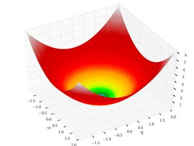
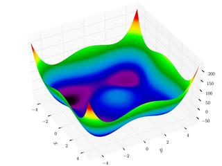

### Description

6-dimensional optimization test functions component

#### Input Variables
* **x1** -  [-]
* **x2** -  [-]
* **x3** -  [-]
* **x4** -  [-]
* **x5** -  [-]
* **x6** -  [-]

#### Output Variables
* **out** -  [-]

### Rosenbrock Function

<!---EQUATION {\displaystyle out = \sum _{i=1}^{5}\left[100\left(x_{i+1}-x_{i}^{2}\right)^{2}+\left(1-x_{i}\right)^{2}\right]} --->

### Sphere Function

<!---EQUATION out = \sum _{i=1}^{6}x_{i}^{2} --->

### Styblinksi-Tang Function

<!---EQUATION out = {\frac {\sum _{i=1}^{6}x_{i}^{4}-16x_{i}^{2}+5x_{i}}{2}}--->

