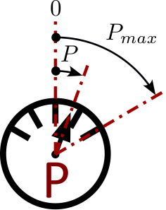

Rotational mechanics power sensor.

### Component type
Signal

### Input Variables
* **PMax** - Max power (animation) [W]

### Output Variables
* **out** - Power at the power port [W]

**PMax** is used to scale the range of the cursor in animation mode.

<!---EQUATION --->

